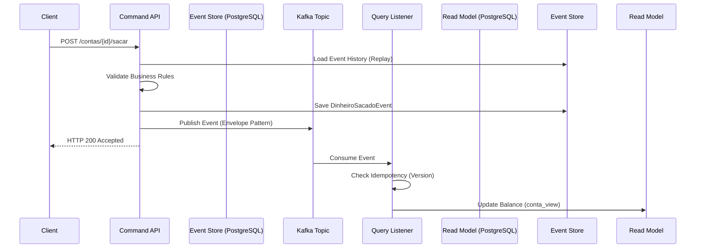
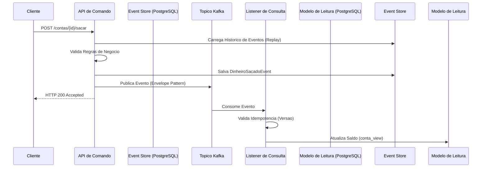

# Core Banking API: CQRS & Event Sourcing Architecture

*Choose your language / Escolha o seu idioma:*
- [🇺🇸 English Version](#english-version)
- [🇧🇷 Versão em Português](#versão-em-português)

---

## English Version

A mission-critical distributed banking API demonstrating advanced architectural patterns including **CQRS**, **Event Sourcing**, **Idempotency**, and **State Snapshots** using Spring Boot and Apache Kafka.

This repository contains a highly scalable banking core API. The system diverges from traditional CRUD architectures by implementing **Command Query Responsibility Segregation (CQRS)** and **Event Sourcing**, utilizing Apache Kafka for asynchronous state synchronization. This architecture guarantees strict auditability, high performance on read operations, and data consistency across distributed boundaries.

---

### 🏛️ Architecture & Core Concepts

#### 1. Event Sourcing

Instead of storing the current state of a bank account (e.g., overriding a balance column), the system persists a **chronological, immutable sequence of domain events** (`AccountCreatedEvent`, `MoneyDepositedEvent`, `MoneyWithdrawnEvent`) in an `event_store`. The current state is derived entirely by replaying these events.

#### 2. CQRS (Command Query Responsibility Segregation)

The system strictly separates write operations from read operations to scale them independently:

- **Command Model (Write):** Handles complex business logic and invariants. It performs Event Replay to validate balances in memory before appending new events to the store.
- **Query Model (Read):** A highly optimized, denormalized view of the data. It is updated asynchronously and serves client requests in milliseconds without complex joins or calculations.

---

### Architecture Flow Diagram



---

### ⚙️ Advanced Patterns Implemented

| Pattern | Description |
|---|---|
| **Idempotency** | The event listener utilizes sequence numbers to discard duplicate messages delivered by Kafka, ensuring financial operations are processed **exactly once**. |
| **State Snapshots** | To prevent performance degradation during Event Replay on long-standing accounts, the system captures and persists a snapshot of the aggregate state **every 10 events**. |
| **Atomic Transactions** | Transfer operations utilize Spring's `@Transactional` boundary to guarantee that both the withdrawal from the source account and the deposit to the destination account succeed or fail as a single unit. |
| **Global Exception Handling** | Implements `@RestControllerAdvice` to intercept business logic violations and translate them into standardized **HTTP 400 JSON** responses. |

---

### Technology Stack

- **Java 24**
- **Spring Boot 3.4**
- **Apache Kafka** — Message Broker
- **PostgreSQL** — Event Store & Read Projections
- **SpringDoc OpenAPI 3.1** — Swagger UI
- **Testcontainers** — Integration Testing

---

###  How to Run and Test

**1. Start the infrastructure** (ensure Docker is installed):

```bash
docker-compose up -d
```

**2. Start the Spring Boot application:**

```bash
./mvnw spring-boot:run
```

**3. Access the interactive OpenAPI documentation:**

```
http://localhost:8080/swagger-ui/index.html
```

---

###  Integration Testing with Testcontainers

This project utilizes advanced integration testing practices. Instead of mocking the database and message broker, we use **Testcontainers** to instantiate real Docker containers during the test lifecycle. This guarantees that the CQRS synchronization, Event Sourcing storage, and Apache Kafka messaging operate correctly in a production-like environment.

To execute the integration tests, ensure the Docker engine is running and execute:

```bash
./mvnw clean test
```

---
---

## Versão em Português

Uma API bancária distribuída de missão crítica demonstrando padrões arquiteturais avançados, incluindo **CQRS**, **Event Sourcing**, **Idempotência** e **Snapshots de Estado**, utilizando Spring Boot e Apache Kafka.

Este repositório contém uma API bancária core altamente escalável. O sistema abandona as arquiteturas CRUD tradicionais para implementar a **Segregação de Responsabilidade de Comando e Consulta (CQRS)** e **Event Sourcing**, utilizando o Apache Kafka para sincronização assíncrona de estado. Esta arquitetura garante auditoria rigorosa, alta performance em operações de leitura e consistência de dados em ambientes distribuídos.

---

###  Arquitetura e Conceitos Principais

#### 1. Event Sourcing

Em vez de armazenar o estado atual de uma conta bancária (ex: sobrescrever a coluna de saldo), o sistema persiste uma **sequência cronológica e imutável de eventos de domínio** (`ContaCriadaEvent`, `DinheiroDepositadoEvent`, `DinheiroSacadoEvent`) em um `event_store`. O estado atual é reconstruído inteiramente através do processamento (replay) desses eventos.

#### 2. CQRS (Command Query Responsibility Segregation)

O sistema separa estritamente as operações de escrita das operações de leitura para escalá-las de forma independente:

- **Modelo de Comando (Escrita):** Processa lógicas de negócio complexas e regras de invariância. Realiza o Event Replay para validar saldos em memória antes de salvar novos eventos no banco.
- **Modelo de Consulta (Leitura):** Uma visão desnormalizada e altamente otimizada dos dados. É atualizada de forma assíncrona e responde às requisições dos clientes em milissegundos, sem agregações ou cálculos complexos no banco de dados.

---

###  Diagrama de Fluxo da Arquitetura



---

###  Padrões Avançados Implementados

| Padrão | Descrição |
|---|---|
| **Idempotência** | O listener do Kafka utiliza números de sequência para descartar mensagens duplicadas entregues pela rede, garantindo que operações financeiras sejam processadas **apenas uma vez**. |
| **Snapshots de Estado** | Para evitar degradação de performance durante o Event Replay em contas antigas, o sistema captura e persiste uma "foto" do estado do agregado **a cada 10 eventos** processados. |
| **Transações Atômicas** | As operações de transferência utilizam o escopo `@Transactional` do Spring para garantir que o saque na origem e o depósito no destino ocorram (ou falhem) de forma unificada. |
| **Tratamento Global de Exceções** | Utiliza `@RestControllerAdvice` para capturar violações de regras de negócio (ex: saldo insuficiente) e traduzi-las em respostas **JSON padronizadas (HTTP 400)**. |

---

### 🛠️ Stack Tecnológica

- **Java 24**
- **Spring Boot 3.4**
- **Apache Kafka** — Message Broker
- **PostgreSQL** — Event Store & Read Projections
- **SpringDoc OpenAPI 3.1** — Swagger UI
- **Testcontainers** — Testes de Integração

---

###  Como Executar e Testar

**1. Inicie a infraestrutura** (certifique-se de ter o Docker instalado):

```bash
docker-compose up -d
```

**2. Execute a aplicação Spring Boot:**

```bash
./mvnw spring-boot:run
```

**3. Acesse a documentação interativa OpenAPI:**

```
http://localhost:8080/swagger-ui/index.html
```

---

###  Testes de Integração com Testcontainers

Este projeto utiliza práticas avançadas de testes de integração. Em vez de simular (mockar) o banco de dados e o broker de mensageria, utilizamos o **Testcontainers** para instanciar containers Docker reais durante o ciclo de vida do teste. Isso garante que a sincronização CQRS, o armazenamento do Event Sourcing e a mensageria do Apache Kafka operem corretamente em um ambiente idêntico ao de produção.

Para executar os testes de integração, certifique-se de que o Docker esteja rodando e execute:

```bash
./mvnw clean test
```
